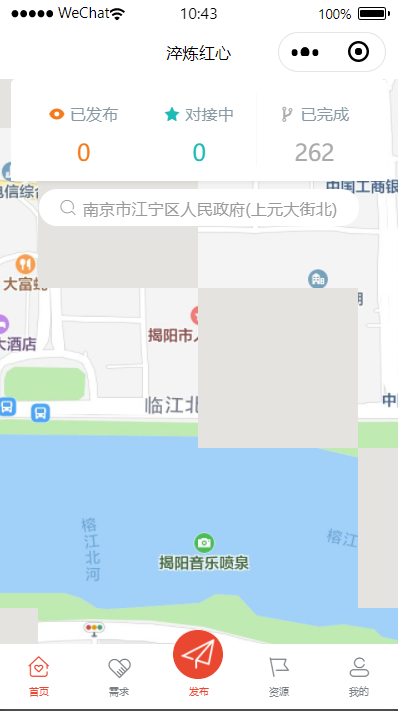
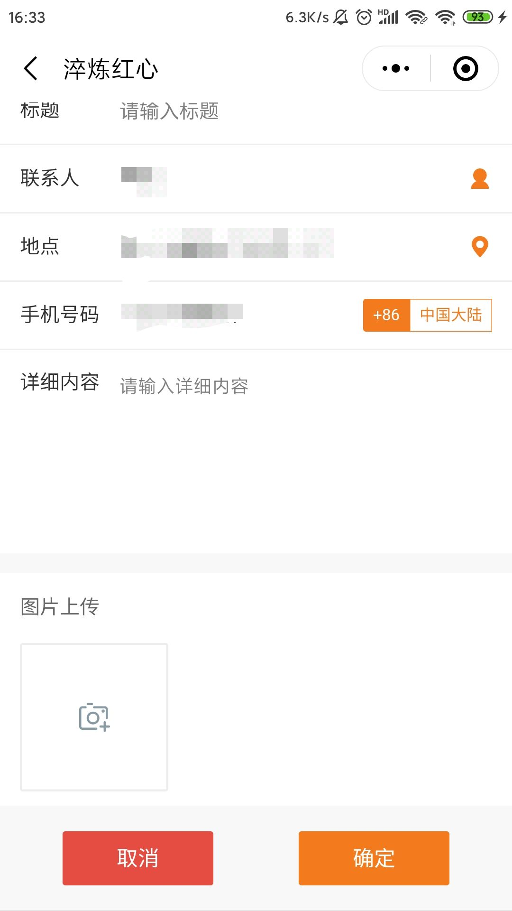
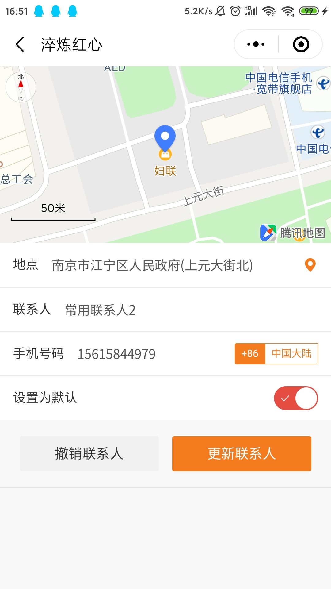
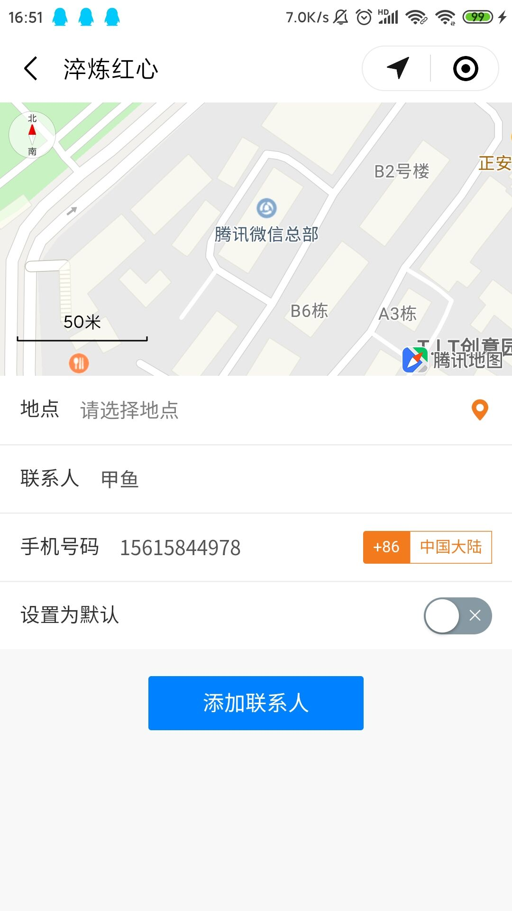
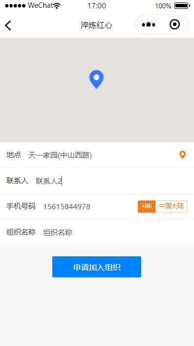

# 淬炼红心小程序文档

## 

## 小程序实现

### 开发人员

张佳钰

### 开发及运行环境

* 编程语言

  * wxml
  * wxss
  * javascript

* 开发环境

  * 微信开发者工具
  * postman
  * google chrome

* 运行环境

  微信小程序运行在多种平台上：iOS（iPhone/iPad）微信客户端、Android 微信客户端、PC 微信客户端、Mac 微信客户端和用于调试的微信开发者工具。

  各平台脚本执行环境以及用于渲染非原生组件的环境是各不相同的：

  * 在 iOS 上，小程序逻辑层的 javascript 代码运行在 JavaScriptCore 中，视图层是由 WKWebView 来渲染的，环境有 iOS 12、iOS 13 等；
  * 在 Android 上，小程序逻辑层的 javascript 代码运行在 [V8](https://developers.google.com/v8/) 中，视图层是由自研 XWeb 引擎基于 Mobile Chrome 内核来渲染的；
  * 在 开发工具上，小程序逻辑层的 javascript 代码是运行在 [NW.js](https://nwjs.io/) 中，视图层是由 Chromium Webview 来渲染的

### 界面功能

| 界面名称 | 界面功能 | 相关文件夹 |
| :--- | :--- | :--- |
| contact | 创建，存储联系人 | contact |
| demands | 查找需求，展示需求 | demands |
| main | 主页展示 | main |
| makeApply | 需求对接申请管理 | makeApply |
| makeDemand | 需求管理，创建，修改，删除，查找需求 | makeDemand |
| mine | 个人中心，包含我的组织，常用联系人，我的需求，我的对接 | mine |
| myApply | 我申请的对接 | myApply |
| myDemands | 我发布的需求 | myDemands |
| organization | 组织管理 | organization |
| makeApplyOrganition | 加入组织的申请管理 | organization/makeApplyOrganition |
| makeOrganization | 创建组织 | organization/makeOrganization |
| myOrganizations | 我创建和加入的组织 | organization/myOrganizations |
| organization | 组织信息 | organization/organization |
| organizations | 组织搜索以及显示所有组织 | organization/organizations |
| makeUserInfo | 个人信息添加以及修改 | userinfo/makeUserInfo |

### 工具模块

|  |
| :--- |

#### api.js\(接口封装\)

对接口中需要传输的url，传输数据等进行定义

#### formUtil.js\(表单工具\)

检测表单中的空内容并提示给用户端，仅可用于检测表单是否存在空填内容

#### http.js\(http封装\)

将`wx.request`封装，简化调用流程

#### timeUtil.wxs\(时间格式化工具\)

将时间戳转化为格式化时间

#### tool.wxs\(显示格式化工具\)

将距离，地址格式化显示

#### util.js

将获取的经纬度通过接口获取地址详情

### 界面模块

#### 登陆界面

* 页面上方为两个按钮，第一个获取微信头像及昵称
* 第二个可以手动登陆
* 系统设置了可以自动登陆（不需要点击登陆，系统自动登陆）

#### 

#### 首页

* 首页上方有一个展示面板，表示已发布的需求数量，对接中的需求数量以及已完成的需求数量
* 首页中间是一个地图表示用户当前所处的位置，缩小之后可以看到许多图标，橙色的图标表示已发布的需求，红色的爱心图标表示已完成的需求
* 点击图标，可以显示需求标题
* 点击需求标题可以查看需求详情
* 中间的选择位置的输入框，点击可以选取地理位置

#### 地址选择页面

* 用户可以通过地图选点和输入地址的方式选择地址

#### 需求详情页面

* 需求详情页面包含需求类型，需求方，开始时间，截止时间 ，需求标题，联系人，地点，手机号码，详细内容以及证明图片
* 在下方可查看需求状态，需求状态分已发布，对接中，已完成，已撤销

#### 需求页面

* 需求页面上方有一个横条，左上角是筛选的地址，可选择，地址旁边是关键字搜索，输入关键字，可筛选出相关需求
* 第二行为大类，分防疫特区，党建宣传，社区服务，特殊困难，项目策划，为小为老六个大类
* 中部左侧为小类，同为筛选的一部分右侧为筛选出来的需求列表
* 点击需求卡片，可以查看需求详情

#### 发布需求页面

发布需求需要填写需求方，开始时间，截止时间 ，需求标题，联系人，地点，手机号码，详细内容以及证明图片等内容

#### 我的页面

* 我的页面包含我的组织，常用联系人，我的需求，我的资源，我的对接
* 页面上方是用户头像和用户昵称

#### 联系人页面

* 常用联系人页面中，中间为常用联系人列表
* 下方的添加联系人按钮，点击即可跳到联系人添加页面
* 点击联系人卡片可查看，修改，撤销联系人信息

* 用户可在该页面对联系人信息进行修改，并选择是否设置为常用联系人

* 用户可在该页面添加联系人信息

#### 我的组织页面

* 页面上方我创建的或我所加入的组织列表
* 页面下方的创建或加入组织按钮，点击可进入创建或加入组织页面

#### 所有组织页面

* 

