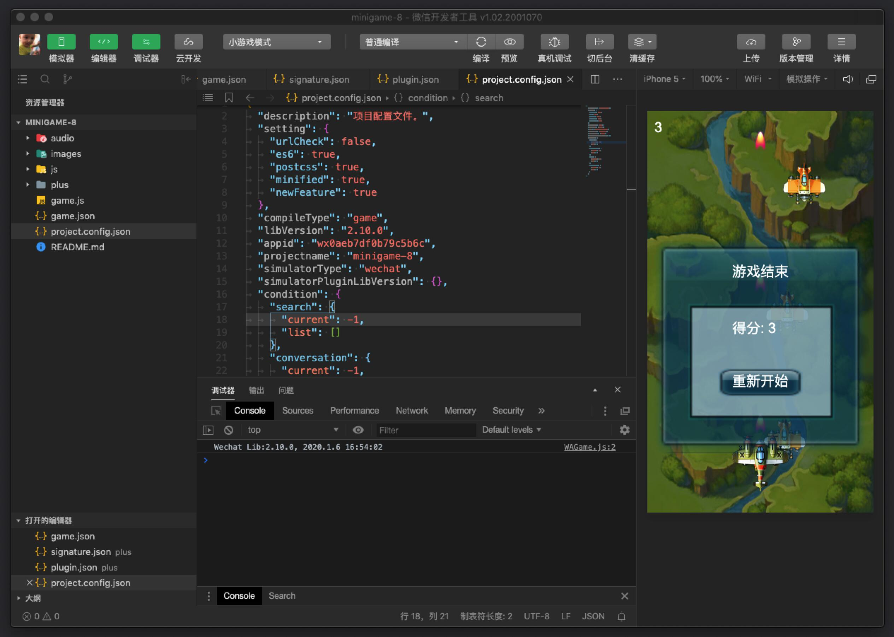

# 1.1 开发环境

## 1.1.1 编程语言

* wxml
* wxss
* javascript

## 1.1.2 开发环境

* 微信开发者工具
  * 它是一个桌面应用，通过模拟微信客户端的表现，使得开发者可以使用这个工具方便地在 PC 或者 Mac 上进行开发和调试工作

    * 1.使用自己的微信号来调试微信网页授权
    * 2.调试、检验页面的 JS-SDK 相关功能与权限，模拟大部分 SDK 的输入和输出
    * 3.使用基于 weinre 的移动调试功能（**仅0.5.0-0.7.0版本支持**），支持&lt;a href="http://x5.tencent.com/guide?id=4000 "X5 Blink 介绍"" target="\_blank"&gt;X5 Blink内核的远程调试
    * 4.利用集成的 Chrome DevTools 协助开发

* postman
  * Postman是用于API开发的协作平台。
  *  Postman的功能简化了构建API的每个步骤并简化了协作，因此可以更快地创建更好的API。

* Google Chrome
  * **Google Chrome**是由[Google](https://zh.wikipedia.org/wiki/Google)开发的[免费](https://zh.wikipedia.org/wiki/%E5%85%8D%E8%B2%BB%E8%BB%9F%E9%AB%94)[网页浏览器](https://zh.wikipedia.org/wiki/%E7%B6%B2%E9%A0%81%E7%80%8F%E8%A6%BD%E5%99%A8)。
  * Chrome是[化学元素](https://zh.wikipedia.org/wiki/%E5%8C%96%E5%AD%B8%E5%85%83%E7%B4%A0)“[铬](https://zh.wikipedia.org/wiki/%E9%89%BB)”的英文名称，过去也用Chrome称呼浏览器的外框。
  * Chrome相应的[开放源代码](https://zh.wikipedia.org/wiki/%E5%BC%80%E6%BA%90%E8%BD%AF%E4%BB%B6)计划名为[Chromium](https://zh.wikipedia.org/wiki/Chromium_%28%E7%80%8F%E8%A6%BD%E5%99%A8%29)，而Google Chrome本身是[非自由软件](https://zh.wikipedia.org/wiki/%E9%9D%9E%E8%87%AA%E7%94%B1%E8%BD%AF%E4%BB%B6)，未开放全部[源代码](https://zh.wikipedia.org/wiki/%E5%8E%9F%E5%A7%8B%E7%A2%BC)。
  * Chrome代码是基于其他开放源代码软件所编写，包括[Apple WebKit](https://zh.wikipedia.org/wiki/Apple_WebKit)和[Mozilla Firefox](https://zh.wikipedia.org/wiki/Mozilla_Firefox)，并开发出称为“[V8](https://zh.wikipedia.org/wiki/V8_%28JavaScript%E5%BC%95%E6%93%8E%29)”的高性能[JavaScript引擎](https://zh.wikipedia.org/wiki/JavaScript%E5%BC%95%E6%93%8E)。Google Chrome的整体发展目标是提升稳定性、速度和安全性，并创造出简单且有效率的用户界面。[CNET](https://zh.wikipedia.org/wiki/CNET)旗下的[Download.com](https://zh.wikipedia.org/wiki/Download.com)网站评出的2008年6月最佳Windows应用程序，其中Google Chrome排名首位。

## 1.1.3 运行环境

微信小程序运行在多种平台上：iOS（iPhone/iPad）微信客户端、Android 微信客户端、PC 微信客户端、Mac 微信客户端和用于调试的微信开发者工具。

各平台脚本执行环境以及用于渲染非原生组件的环境是各不相同的：

* 在 iOS 上，小程序逻辑层的 javascript 代码运行在 JavaScriptCore 中，视图层是由 WKWebView 来渲染的，环境有 iOS 12、iOS 13 等；
* 在 Android 上，小程序逻辑层的 javascript 代码运行在 [V8](https://developers.google.com/v8/) 中，视图层是由自研 XWeb 引擎基于 Mobile Chrome 内核来渲染的；
* 在 开发工具上，小程序逻辑层的 javascript 代码是运行在 [NW.js](https://nwjs.io/) 中，视图层是由 Chromium Webview 来渲染的

