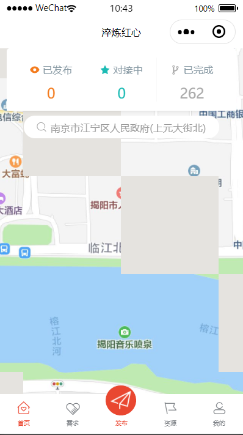
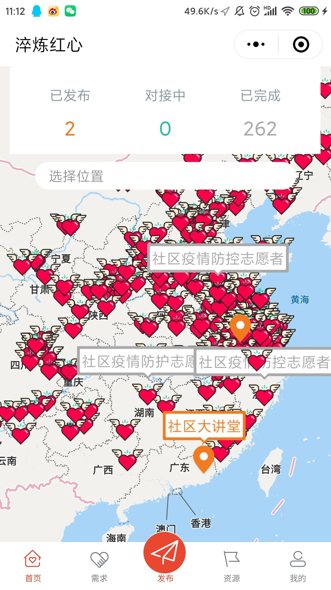
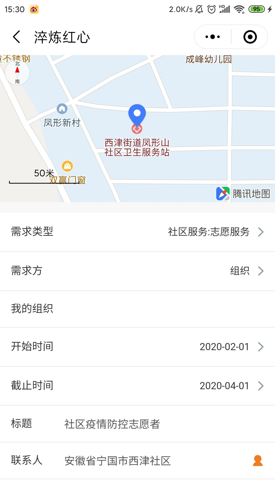
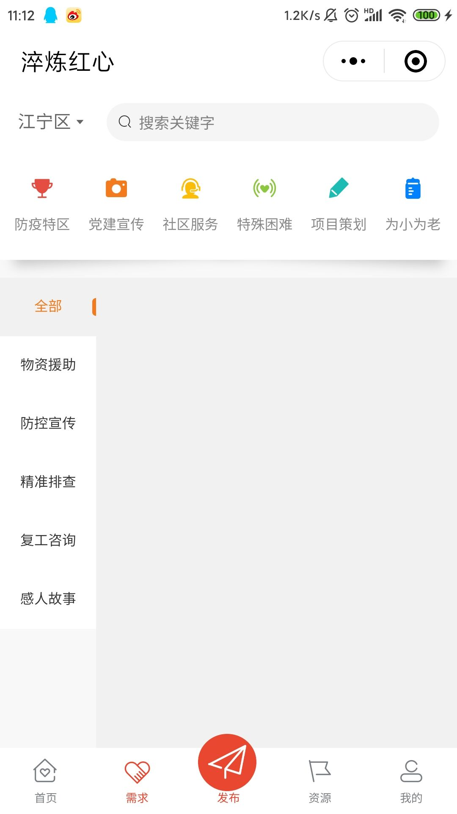
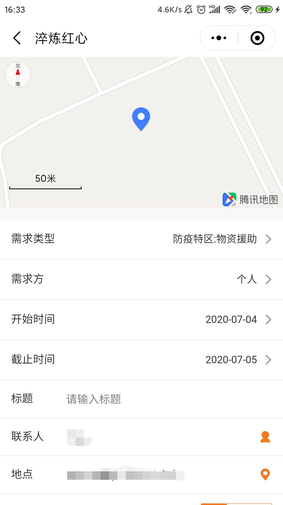
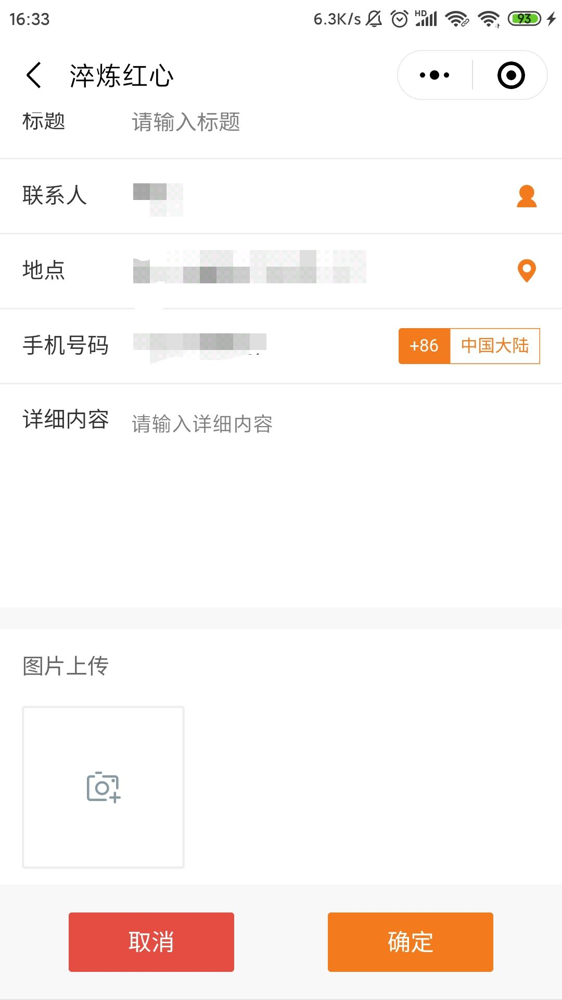
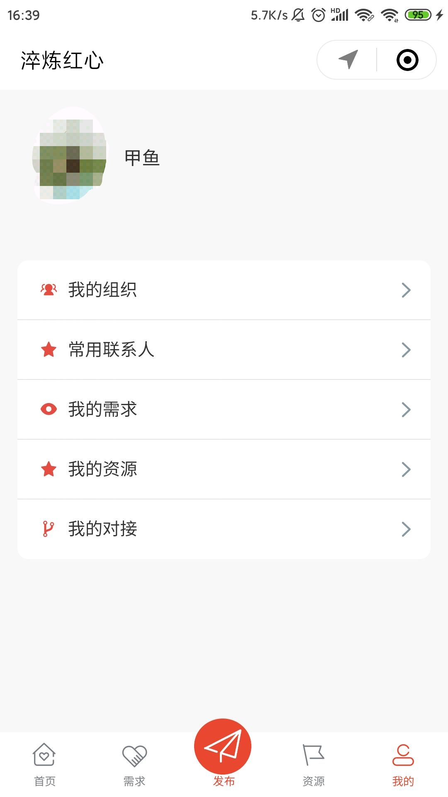
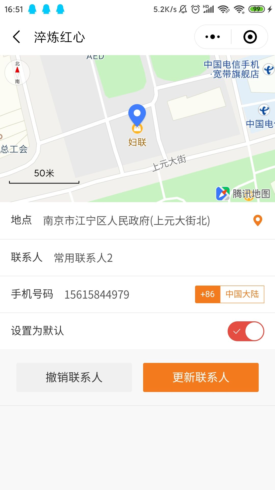
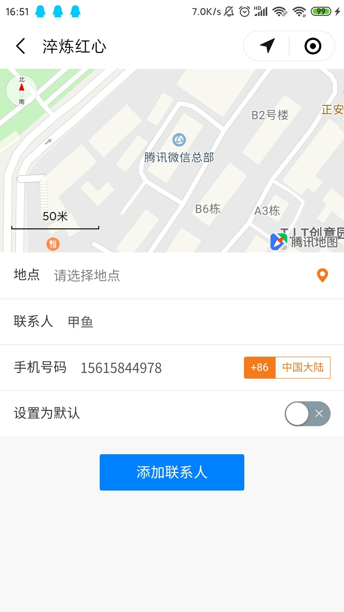
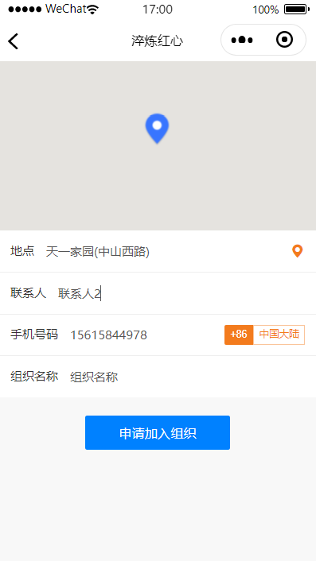

# 1.4 页面模块

## 1.4.1 登陆界面

* 页面上方为两个按钮，第一个获取微信头像及昵称
* 第二个可以手动登陆
* 系统设置了可以自动登陆（不需要点击登陆，系统自动登陆）

## 1.4.2 首页

* 首页上方有一个展示面板，表示已发布的需求数量，对接中的需求数量以及已完成的需求数量
* 首页中间是一个地图表示用户当前所处的位置，缩小之后可以看到许多图标，橙色的图标表示已发布的需求，红色的爱心图标表示已完成的需求
* 点击图标，可以显示需求标题
* 点击需求标题可以查看需求详情
* 中间的选择位置的输入框，点击可以选取地理位置

## 1.4.3 地址选择页面

* 用户可以通过地图选点和输入地址的方式选择地址

## 1.4.4 需求详情页面

* 需求详情页面包含需求类型，需求方，开始时间，截止时间 ，需求标题，联系人，地点，手机号码，详细内容以及证明图片
* 在下方可查看需求状态，需求状态分已发布，对接中，已完成，已撤销

## 1.4.5 需求页面

* 需求页面上方有一个横条，左上角是筛选的地址，可选择，地址旁边是关键字搜索，输入关键字，可筛选出相关需求
* 第二行为大类，分防疫特区，党建宣传，社区服务，特殊困难，项目策划，为小为老六个大类
* 中部左侧为小类，同为筛选的一部分右侧为筛选出来的需求列表
* 点击需求卡片，可以查看需求详情

## 1.4.6 发布需求页面

* 发布需求需要填写需求方，开始时间，截止时间 ，需求标题，联系人，地点，手机号码，详细内容以及证明图片等内容
* 在填写成功之后点击确认即可
* 也可以点击取消退出编辑

## 1.4.7 我的页面

* 我的页面包含我的组织，常用联系人，我的需求，我的资源，我的对接
* 页面上方是用户头像和用户昵称

## 1.4.8 联系人页面

* 常用联系人页面中，中间为常用联系人列表
* 下方的添加联系人按钮，点击即可跳到联系人添加页面
* 点击联系人卡片可查看，修改，撤销联系人信息

* 用户可在该页面对联系人信息进行修改，并选择是否设置为常用联系人

* 用户可在该页面添加联系人信息

## 1.4.9 我的组织页面

* 页面上方我创建的或我所加入的组织列表
* 页面下方的创建或加入组织按钮，点击可进入创建或加入组织页面

## 1.4.10 所有组织页面

* 该页面上方有一个输入框，辅助搜索
* 主要展示筛选的组织
* 底部的创建组织按钮，点击可以创建组织

* 创建组织需要填写地点，联系人，手机号码，组织名称等信息

* 申请组织需要填写申请加入的理由

