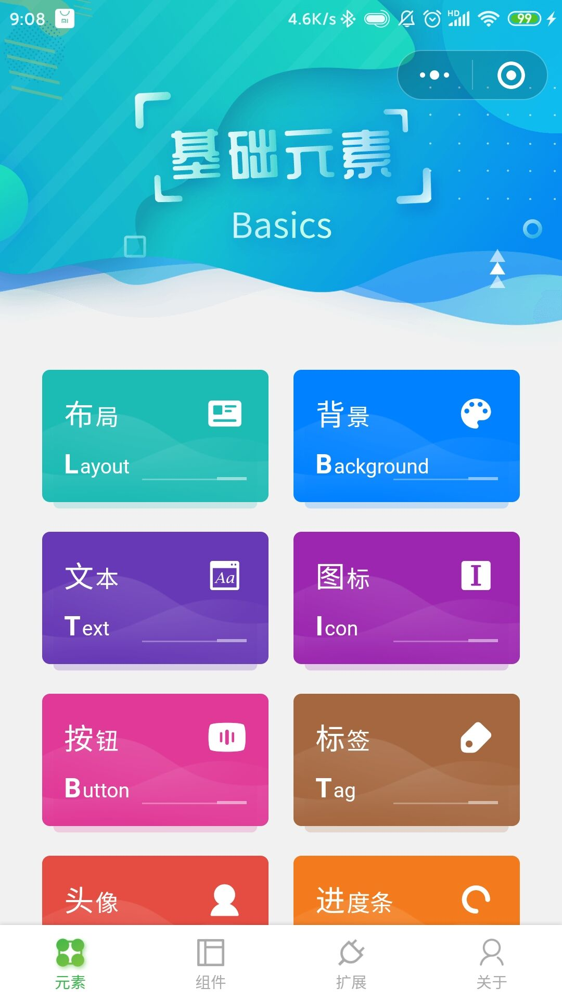
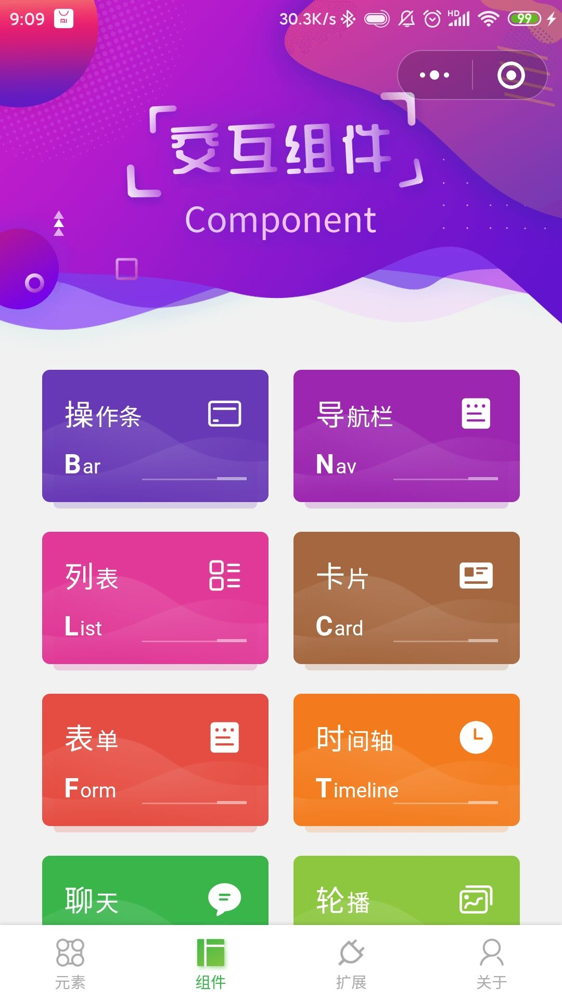
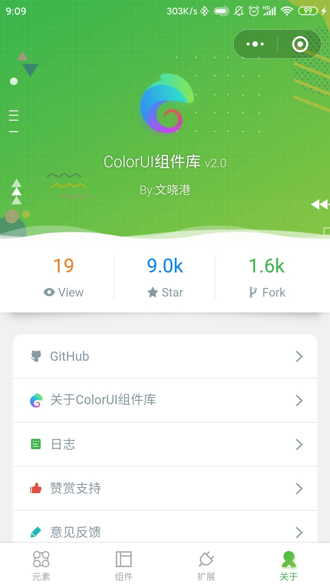

# 1.5 组件库

## ColorUI

基于以下三个特点，我们选用了ColorUI作为组件库

1. 组件精美，色彩十分鲜艳
2. 封装特别的好，每一个样式都是单独的class选择器，都是封装极好的css小组件
3. 兼容性，扩展性极好。亲测在vant weep组件上可以完美使用，并且对于微信原生组件的支持很好。

#### 使用方法

[https://github.com/weilanwl/ColorUI](https://github.com/weilanwl/ColorUI)

