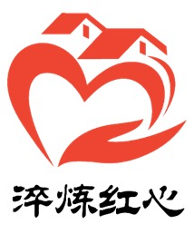
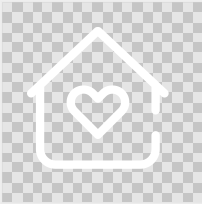

# 1.6 图标

### 1.5.1 淬炼红心图标

### 1.5.2 导航栏图标

* 首页

首页图标为一个小屋，小屋内有一个爱心，表示爱心小屋，爱心社区

* 需求

需求图标由两只手组成的爱心，寓意需求中供求双方达成了共识，与友好合作关系

* 发布

发布图标为一只小飞机，表示发布的需求的速度快，也暗示该需求能够在很短的时间内找到对接方

* 资源

* 我的

图标为一个人的上半身，表示用户中心

##  

